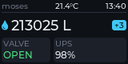
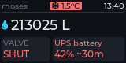

Moses
=====

Moses is a do-it-yourself water-leak breaker built around a Raspberry
Pi. It watches household water usage and can shut the main supply with a
solenoid valve, so a leak does not turn into water damage. Everything is
driven over [MQTT](https://mqtt.org/), so it integrates with existing
home-automation setups (Home Assistant, Node-RED, …) without locking you
into a proprietary cloud.

| Program            | Role                                                       |
| ------------------ | ---------------------------------------------------------- |
| `moses_watermeter` | Read the water meter (M-Bus index, GPIO pulses), spot leaks |
| `moses_breaker`    | Open/close the solenoid valve through a relay              |
| `moses_sensors`    | Read the optional BME280 (temperature, pressure, humidity) |
| `moses_display`    | Show the installation on the HAT's LCD (optional)          |

The valve is *normally open*: `moses_breaker` only energises the relay
to close the water, so a power loss or a crash leaves the supply open.

| Water flowing, on mains | Valve shut, freezing, on battery |
| :---------------------: | :------------------------------: |
|  |  |

The panel, as `moses_display` draws it on the HAT's 160x80 LCD. These
are the test suite's own reference images (`test/ref-imgs/`), so they
are what the code renders today.

Documentation
-------------

| Document                                 | What is in it                             |
| ---------------------------------------- | ----------------------------------------- |
| [docs/hardware.md](docs/hardware.md)     | Parts, pin map, each hat's `/boot` set-up |
| [docs/system.md](docs/system.md)         | Watchdog, WiFi, NUT, swap                 |
| [docs/building.md](docs/building.md)     | Prerequisites, flavours, options, install |
| [docs/programs.md](docs/programs.md)     | Options, environment, `loop-runner`       |
| [docs/interfaces.md](docs/interfaces.md) | MQTT, line protocol, D-Bus                |
| [docs/leak.md](docs/leak.md)             | Leak detection: principle, rules, limits  |
| [docs/alert.md](docs/alert.md)           | Alerts on the panel, every screen          |
| [test/README.md](test/README.md)         | The test suite                            |
| [DESIGN.md](DESIGN.md)                   | Why it is shaped this way                 |

How it fits together
--------------------

~~~text
                    +----------------------+
   M-Bus ---------> |                      | --> <prefix>/index
   pulse (GPIO) --> |  moses_watermeter    | --> <prefix>/pulse
                    |                      | --> <prefix>/leak (--leak)
                    +----------------------+ --> <prefix>/error
                                             --> <prefix>/availability/watermeter

   <prefix>/state/set --> +----------------+
                          | moses_breaker  | --> relay --> solenoid valve
   <prefix>/state     <-- +----------------+ --> <prefix>/error
                                             --> <prefix>/availability/breaker

                    +----------------------+
   BME280 (I2C) --> |  moses_sensors       | --> <prefix>/sensors
                    +----------------------+ --> <prefix>/error
                                             --> <prefix>/availability/sensors

   <prefix>/index      --> +----------------+
   <prefix>/pulse      --> |                |
   <prefix>/leak       --> |                |
   <prefix>/state      --> | moses_display  | --> LCD
   <prefix>/sensors    --> |                |
   <prefix>/availability/* +----------------+
                           ^      ^      ^
   ups/+/state ------------+      |      +----- upsd on localhost:3493
                                  |             (--ups, or local)
   moses.* on the system bus -----+
~~~

`<prefix>` is `MQTT_TOPIC_PREFIX` (default `water-breaker`). The same
readings can also go to stdout and to the system D-Bus; see
[docs/interfaces.md](docs/interfaces.md). `moses_display` reads one or
the other: the broker, or with `--source=local` the bus and `upsd` and
no broker at all ([docs/programs.md](docs/programs.md#moses_display)).

Quick start
-----------

On the Pi, once the hats are set up ([docs/hardware.md](docs/hardware.md)):

~~~sh
apt install build-essential cmake libmosquitto-dev libdbus-1-dev
git clone --recursive https://github.com/sdalu/moses
cd moses
make build FLAVOUR=sensors     # the three daemons, without the panel
make install FLAVOUR=sensors
install -m 0644 dbus/moses.conf /etc/dbus-1/system.d/
~~~

`FLAVOUR=sensors` leaves out `moses_display`, whose LVGL compile takes
some seven hours on a Pi Zero (see [Flavours](docs/building.md#flavours)).
Then point the daemons at the broker and start them, each normally under
[`loop-runner`](docs/programs.md#supervision):

~~~sh
export MQTT_HOST=broker.example
export MQTT_TOPIC_PREFIX=water-breaker/moses
moses_watermeter -i 1min
moses_breaker    -P rpi:36 -M open-source
moses_sensors    -i 1min
~~~

When something is wrong
-----------------------

| Symptom                                    | See                                                         |
| ------------------------------------------ | ----------------------------------------------------------- |
| The pulse count stays at zero              | [Pulse counting](docs/hardware.md#pulse-counting)           |
| `Failed to receive M-Bus response frame.`  | [UART](docs/hardware.md#uart)                               |
| A daemon logs `cannot own moses.…`         | [Install](docs/building.md#install): `dbus/moses.conf`      |
| The broker is down, the water must be shut | [Shutting the water](docs/interfaces.md#shutting-the-water) |

License
-------

GNU General Public License, version 2; see [LICENSE](LICENSE).
