Alerts on the panel
===================

What `moses_display` shows when something is wrong, and every screen it
can show for it. Every picture here is one of the test suite's own
reference images (`test/ref-imgs/`), so this page cannot show a screen
the code no longer draws: `test/test_dashboard.c` renders them and
fails when a pixel moves. What the leak rules look for is in
[leak.md](leak.md); what the panel is otherwise, in
[programs.md](programs.md#moses_display).

The rule
--------

Colour says how sure the panel is, and it has four values:

| Colour     | Means                                                           |
| ---------- | --------------------------------------------------------------- |
| its own    | a current reading: the meter cyan, an open valve green          |
| dim grey   | unknown: its daemon is `offline`, or has said nothing for a while |
| **amber**  | suspect: something is probably wrong, not yet known to be       |
| **red**    | known and bad: a leak, the valve shut, the room at freezing, on battery |

Red is kept for what the machine knows. A panel that painted "not sure"
red would cry wolf every time the broker hiccuped, so amber and grey
exist to keep red meaning red.

The leak banner
---------------

While the watermeter's leak report ([interfaces.md](interfaces.md#leaks))
is not `ok`, it takes the header's row. The header is the row to give
up: the meter, the flow and the valve are exactly what a leak makes worth
reading, and the name and the clock can wait.

| Report       | Icon (Font Awesome) | Colour | Left              | Right    |
| ------------ | ------------------- | ------ | ----------------- | -------- |
| flow alert   | house-flood-water   | red    | `Flow 5.6 L/min`  | `42 min` |
| slow alert   | faucet-drip         | red    | `Drip 3.3 L/h`    | `5 h 12` |
| quiet warning | faucet             | amber  | `Never quiet`     | `26 h`   |

The right-hand side is always how long the leak has gone on, from the
report's `since`: `42 min` under an hour, `5 h 12` under a day, `26 h`
past it. It moves once a minute, which is the one redraw a standing leak
costs. The banner leaves as soon as the report is `ok` again.

The report is retained and sent only when it changes, so it is not
greyed by `--stale` like a reading. It is greyed when the watermeter is
`offline`: its last report may still be true, but nothing vouches for
it any more.

The room
--------

A room at freezing (4 °C and below) or far too hot (60 °C and up) is
known and bad, and it comes from `moses_sensors`, not from the
watermeter. It gets a red box of its own with its icon, a snowflake or
a flame, wherever it shows:

* in the header, when there is no leak;
* at the banner's right, beside a leak -- the row then reads as split
  in two, the leak in its own colour and the room in red. The duration
  gives it the room: there are 156 pixels for the two.

So a freezing room stays red beside an amber warning, and beside a leak
report that went grey with its watermeter.

Every screen
------------

Each state of the leak report, in a normal, a freezing and a far too hot
room, with the watermeter online and gone. The water badge (`+6`) is lit
in the flow screens with the watermeter online: pulses are coming.

### No leak

The header as it always is. A room at freezing or far too hot is the one alert it can carry: its temperature in a red box, with its icon.

| Room | Watermeter online | Watermeter offline |
| ---- | :---------------: | :----------------: |
| 21.4 °C | 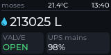 | 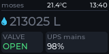 |
| 1.5 °C, freezing | 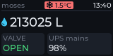 | 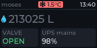 |
| 61 °C, far too hot | 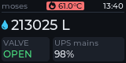 | 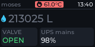 |

### Flow

Water that has not stopped for 20 minutes: red, the flow rate, how long. The water badge on the meter row stays lit while pulses come.

| Room | Watermeter online | Watermeter offline |
| ---- | :---------------: | :----------------: |
| 21.4 °C | 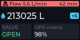 | 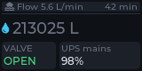 |
| 1.5 °C, freezing | 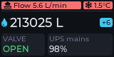 | 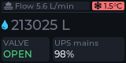 |
| 61 °C, far too hot | 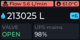 | 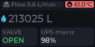 |

### Drip

A regular drip found in lone litres: red, the drip rate in L/h, how long the run has lasted.

| Room | Watermeter online | Watermeter offline |
| ---- | :---------------: | :----------------: |
| 21.4 °C |  | 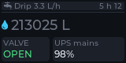 |
| 1.5 °C, freezing | 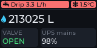 | 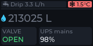 |
| 61 °C, far too hot | 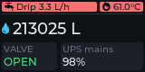 | 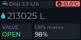 |

### Never quiet

No quiet stretch in 24 hours: a warning, so amber, not red, and how long the house has gone without one.

| Room | Watermeter online | Watermeter offline |
| ---- | :---------------: | :----------------: |
| 21.4 °C | 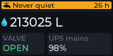 | 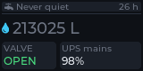 |
| 1.5 °C, freezing | 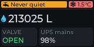 | 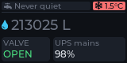 |
| 61 °C, far too hot | 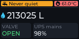 | 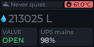 |

### The widest

The widest the banner gets, a fast drip over a long run. If it ever
overflows, it overflows here.

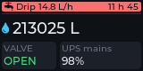

Changing a screen
-----------------

The pictures are rewritten only on purpose:

~~~sh
make tests-refs                 # rewrite test/ref-imgs/ from what the screen renders
git diff --stat test/ref-imgs   # which ones moved
make tests-display              # confirm they compare equal
~~~

and then **look** at every image that moved before committing it
([test/README.md](../test/README.md#screenshot-tests)). The icons are a
generated font, `src/display/icons.c`, whose header says how to add one.
